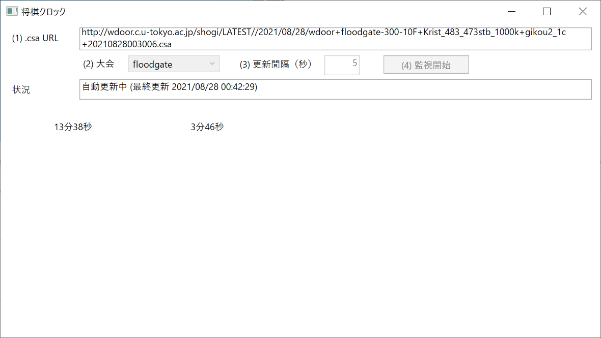

# shogi-clock-wpf

  

floodgate、または 電竜戦 の　残り持ち時間　を覗き見ます。  
リアルタイムでのカウントダウンはしません。  
フィッシャークロック・ルールのみ対応、秒読み無理。  

## Set up

Visual Studio 2019 とか使って ソースをビルドしてください。  

## Run

フォルダー階層は違うかも知れませんが  
`C:\GitHub\shogi-clock-wpf\ShogiClock\ShogiClock\bin\Release\ShogiClock.exe` をダブルクリックしてください。  

電竜戦と floodgate で細かく違うから 両方で動作テストしてください。  

## Stop

対局が終了すると止まります。  
途中で止めるには、ウィンドウを閉じて強制終了してください。  

## Step up

かっこいい時計が欲しいなら、WPFで作ってるので ビューとか一から改造してみてください。  
